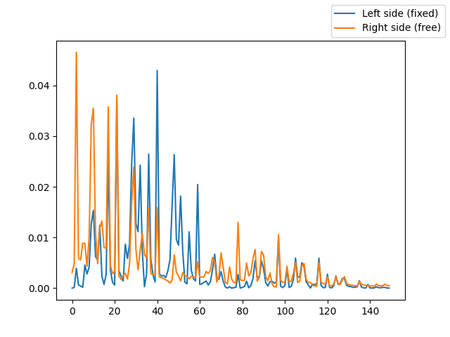

# waves
A python simulation of waves on a string

From the giordano and nakanishi book

**6.9**

Perform a spectrum analysis of waves on a string in which one end is free to move while the other is held fixed. Assume an initial Gaussian wavepacket located 40% from one end. Explain the peaks in the spectrum in terms of the allowed standing waves. Note that because the ends are free, these standing waves will be different from those found with fixed ends. (Fig 6.8)

# General wave equation

$$\frac{\partial^2y}{\partial t^2} = c^2\frac{\partial^2y}{\partial x^2}$$

This turns into: 

$$y(i,n+1) = 2[1-r^2]y(i,n)-y(i,n-1)+r^2[y(i+1,n)+y(i-1,n)]$$
$$r = \frac{c\Delta t}{\Delta x} \approx 1$$

Note: n has to do with time and i has to do with position

# Fourier spectrum
The discrete fourier transform (DFT) method was used. This can calculate with small uncertainty the frequencies of waves. We will calculate the frequencies of these waves and analyze them in the next section.

# Results

Output for the fundamental frequencies:

The fundamental frequencies (left) are: [2, 6, 10, 13, 17, 21, 25, 29, 32, 36, 40, 43, 48, 51, 55, 59, 63, 67, 70, 74, 78, 82, 86, 89, 94, 97, 101, 105, 108, 113, 116, 120, 124, 127, 135, 139, 143, 146, 154, 158, 162, 166, 169, 173, 177, 179, 181, 185, 188, 192, 196, 200, 204, 207, 211, 215, 219, 223, 227, 230, 234, 238, 242, 245, 250, 253, 257, 261, 265, 269, 272, 276, 280, 284, 288, 291, 295, 299, 303, 306, 310, 314, 318, 322, 325, 329, 333, 337, 341, 344, 348, 352, 356, 360, 363, 367, 371]

The fundamental frequencies (right) are: [2, 5, 10, 14, 17, 21, 25, 29, 33, 36, 40, 48, 52, 56, 59, 63, 66, 70, 74, 78, 82, 86, 89, 93, 97, 101, 105, 109, 116, 120, 124, 128, 135, 140, 143, 147, 155, 159, 165, 168, 170, 173, 177, 180, 184, 188, 192, 196, 199, 203, 207, 211, 215, 217, 219, 222, 226, 228, 234, 238, 243]

# Analysis

Observing the fundamental frequencies for each side, we see that they are almost the same frequencies. The interesting part is the power is greater for the free side at lower frequencies, and the power is greater for the fixed side at higher frequencies. After about 60 Hz, they settle down and there isn't much variation on the free vs. the fixed side. 